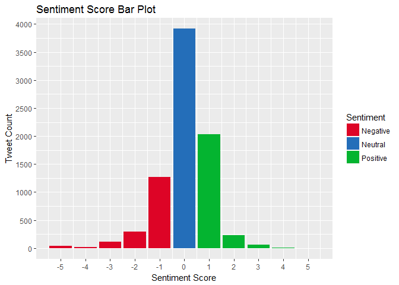

Demonetization Sentiment Analysis
================

``` r
library(twitteR)
library(tm)
library(SnowballC)
library(wordcloud)
library(RCurl)
library(ROAuth)
library(stringr)
library(ggplot2)

tweets.df <- read.csv("demonetization-local.csv")
str(tweets.df)
```

    ## 'data.frame':    7994 obs. of  15 variables:
    ##  $ X            : int  1 2 3 4 5 6 7 8 9 10 ...
    ##  $ text         : Factor w/ 2541 levels "'#Exporters hails #demonetization but seek some extra care'\nRead More: https://t.co/8syb5DQP1M\n\n#export #import #news",..: 2185 1699 1697 1787 1699 1886 1686 1958 1663 567 ...
    ##  $ favorited    : logi  FALSE FALSE FALSE FALSE FALSE FALSE ...
    ##  $ favoriteCount: int  0 0 0 0 0 0 0 0 0 0 ...
    ##  $ replyToSN    : Factor w/ 205 levels "11AshokaRoad",..: NA NA NA NA NA NA NA NA NA 135 ...
    ##  $ created      : Factor w/ 7478 levels "2016-11-22 11:33:01",..: 7478 7477 7476 7475 7474 7473 7472 7471 7470 7469 ...
    ##  $ truncated    : logi  FALSE FALSE FALSE FALSE FALSE FALSE ...
    ##  $ replyToSID   : num  NA NA NA NA NA ...
    ##  $ id           : num  8.02e+17 8.02e+17 8.02e+17 8.02e+17 8.02e+17 ...
    ##  $ replyToUID   : num  NA NA NA NA NA ...
    ##  $ statusSource : Factor w/ 73 levels "<a href=\"http://adobe.com\" rel=\"nofollow\">Adobe® Social</a>",..: 28 27 28 27 27 27 25 28 28 27 ...
    ##  $ screenName   : Factor w/ 5933 levels "___baddog","___JCS",..: 467 2861 194 903 1355 1355 5762 1503 171 221 ...
    ##  $ retweetCount : int  19 95 61 23 95 3 6 265 87 0 ...
    ##  $ isRetweet    : logi  TRUE TRUE TRUE TRUE TRUE TRUE ...
    ##  $ retweeted    : logi  FALSE FALSE FALSE FALSE FALSE FALSE ...

``` r
tweets <- as.character(tweets.df$text)
```

### Calculating sentiment score on the basis of words used in the tweets.

#### Sentiment Score examples :

##### "Demonetization is brilliant. But people are suffering a bit." Score = 0(+brilliant, -suffering)

##### "Kejriwal posts pic of dead robber and claims it's \#demonetization related death? How shameless has this man become? " Score = -3 (-dead, -death, -shameless)

##### "Putting Nation over Party Politics \#nitishkumar supports PM @narendramodi on \#Demonetization" - Score = +1 (+Supports)

``` r
sentiment.score <- function(sentences, positive.words, negative.words, .progress='none')
{
    require(plyr)
    require(stringr)
    
    # we got a vector of sentences. plyr will handle a list or a vector as an "l" for us
    # we want a simple array of scores back, so we use "l" + "a" + "ply" = laply:
    scores <- laply(sentences, function(sentence, positive.words, negative.words)
    {
                
        ## clean up sentences with R's regex-driven global substitute, gsub():
            
        sentence <- gsub('[[:cntrl:]]', '', sentence)
                
        # remove retweets
        sentence <- gsub('(RT|via)((?:\\b\\W*@\\W+)+)', '', sentence)
                
        # remove at people
        sentence <- gsub('@\\w+', '', sentence)
                
        # remove punctuations
        sentence <- gsub('[[:punct:]]', '', sentence)
                
        # remove numbers
        sentence <- gsub('[[:digit:]]', '', sentence)
                
        # remove html links
        sentence <- gsub('http[s]?\\w+', '', sentence)
                
        # remove extra spaces
        sentence <- gsub('[ \t]{2,}', '', sentence)
        sentence <- gsub('^\\s+|\\s+$', '', sentence)
                
        # removing NA's
        sentence <- sentence[!is.na(sentence)]
                
        # convert to lower case:
        sentence <- tolower(sentence)
                
        # split into words. str_split is in the stringr package
                
        word.list <- str_split(sentence, '\\s+')
                
        # sometimes a list() is one level of hierarchy too much
                
        words <- unlist(word.list)
            
        # compare our words to the dictionaries of positive & negative terms
                
        negative.matches <- match(words, negative.words)
        positive.matches <- match(words, positive.words)
                
        # match() returns the position of the matched term or NA
        # we just want a TRUE/FALSE:
                
        positive.matches <- !is.na(positive.matches)
        negative.matches <- !is.na(negative.matches)
                
        # and conveniently enough, TRUE/FALSE will be treated as 1/0 by sum():
                
        score <- sum(positive.matches) - sum(negative.matches)
                
        return(score)
    }, positive.words, negative.words, .progress=.progress )
            
    scores.df <- data.frame(score=scores, text=sentences)
    return(scores.df)
}

positive <- scan("positive-words.txt", what= "character", comment.char= ";")
negative <- scan("negative-words.txt", what= "character", comment.char= ";")

tweets.analysis <- sentiment.score(tweets, positive, negative, .progress="none")

str(tweets.analysis)
```

    ## 'data.frame':    7994 obs. of  2 variables:
    ##  $ score: int  0 0 1 -2 0 2 1 1 0 1 ...
    ##  $ text : Factor w/ 2541 levels "'#Exporters hails #demonetization but seek some extra care'\nRead More: https://t.co/8syb5DQP1M\n\n#export #import #news",..: 2185 1699 1697 1787 1699 1886 1686 1958 1663 567 ...

``` r
tweets.analysis$sentiment[tweets.analysis$score == 0] <- "Neutral" 
tweets.analysis$sentiment[tweets.analysis$score < 0] <- "Negative"
tweets.analysis$sentiment[tweets.analysis$score > 0] <- "Positive"

tweets.analysis$sentiment <- factor(tweets.analysis$sentiment)
```

Analysis
--------

``` r
table(tweets.analysis$score)
```

    ## 
    ##   -5   -4   -3   -2   -1    0    1    2    3    4    5 
    ##   45   18  111  300 1265 3919 2033  235   60    7    1

``` r
mean(tweets.analysis$score) # slighlty positive
```

    ## [1] 0.02764573

``` r
median(tweets.analysis$score)
```

    ## [1] 0

``` r
summary(tweets.analysis$sentiment) # more positive tweets than negative
```

    ## Negative  Neutral Positive 
    ##     1739     3919     2336

Bar Plot
========

``` r
ggplot(data = tweets.analysis, aes(x = score, fill = sentiment)) + 
    geom_bar() + 
    labs(title = "Sentiment Score Bar Plot", x = "Sentiment Score", y = "Tweet Count") +
    scale_x_continuous(breaks = seq(-6,6,1)) + 
    scale_y_continuous(breaks = seq(0,4000,500)) + 
    scale_fill_manual(guide = guide_legend("Sentiment"), values = c("#DD0426","#246EB9","#04B430"))
```


